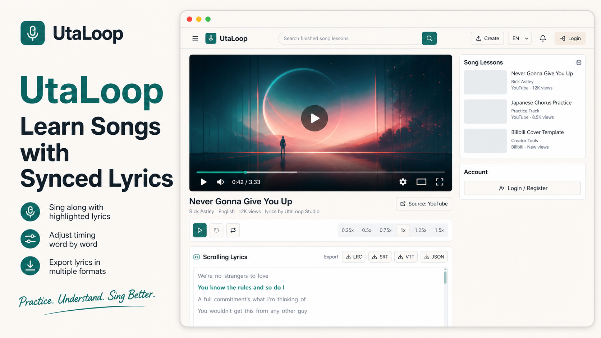

# UtaLoop



YouTube singing practice studio built with Next.js, React, TypeScript, Tailwind CSS, shadcn-style components, the YouTube IFrame Player API, and a REST API surface ready for Supabase/PostgreSQL.

## Run

```bash
npm install
npm run dev
```

Open `http://localhost:3000`.

## Current MVP

- Load a YouTube video by URL or video ID.
- Paste LRC, SRT, or WebVTT timed lyrics.
- Fetch available YouTube captions first, then fall back to pasted lyrics when captions are unavailable.
- Normal learning mode searches completed in-site song videos by song name.
- Watch page keeps only the learning surface: video, scrolling lyrics, source link, comments, and related completed videos.
- Creator mode contains source video loading, YouTube caption language fetch, lyric upload, timing adjustment, and submission.
- Auto Align job API for server-side lyric timing alignment; current implementation is a heuristic placeholder ready to be replaced by WhisperX/Demucs.
- Login/register/profile entry points with normal user and admin roles.
- Admin review API and UI skeleton for approving or rejecting submitted lyrics.
- Bilibili URL recognition and embedded playback, with manual lyric creation support.
- Parse lyrics into normalized line and word timing objects.
- Click a lyric line to seek the YouTube player.
- Highlight the active line and estimated active word.
- Replay the current line.
- Loop the current line.
- Change playback rate.
- REST endpoints for video resolution, subtitle parsing, and progress persistence.

## Project Shape

```txt
src/app
  page.tsx
  api/
    videos/
    subtitles/parse/
    progress/

src/components
  learn/
  ui/

src/lib
  subtitles.ts
  youtube.ts
  utils.ts

src/store
  player-store.ts

src/types
  lyrics.ts
  youtube-player.d.ts
```

The current repo starts as a single Next.js app, but the API routes are intentionally shaped so they can move into an independent service later.

## REST Roadmap

```txt
POST /api/videos
GET /api/videos/:id
GET /api/videos/:id/subtitles?lang=ja
GET /api/videos/:id/subtitles?list=1
POST /api/videos/:id/subtitles
POST /api/subtitles/parse
GET /api/subtitles/:id/lyrics
PUT /api/progress
GET /api/progress?videoId=:id
POST /api/pronunciation/attempts
GET /api/songs?q=:songName
POST /api/auth/login
POST /api/auth/register
POST /api/submissions
GET /api/submissions
PATCH /api/admin/submissions/:id
POST /api/alignment/jobs
GET /api/alignment/jobs/:id
```

## Auto Alignment

`POST /api/alignment/jobs` currently runs synchronously with a heuristic word-duration aligner so the UI flow is usable. The intended production worker can replace this with:

```txt
download/extract audio
  -> separate vocal stem
  -> WhisperX or forced aligner
  -> return line/word timestamps
  -> creator reviews and saves
```

## Auth

The UI and API boundary are ready for Supabase Auth. Current auth routes return demo sessions so the app flow can be tested before Supabase environment variables are connected. Admin demo login is any email containing `admin`.

## Supabase

See `supabase/schema.sql` for the planned PostgreSQL tables.

## Captions

The app currently uses `youtube-transcript` on the server side to fetch public captions because the official YouTube Data API does not provide arbitrary public caption text without the caption owner's authorization. The API boundary is isolated at `GET /api/videos/[videoId]/subtitles`, so it can later be replaced with an official OAuth-backed captions service or a dedicated subtitle microservice.
